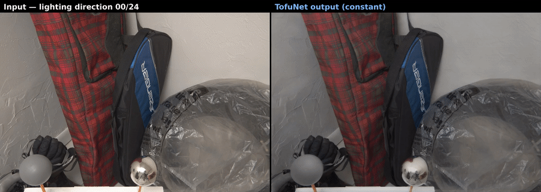
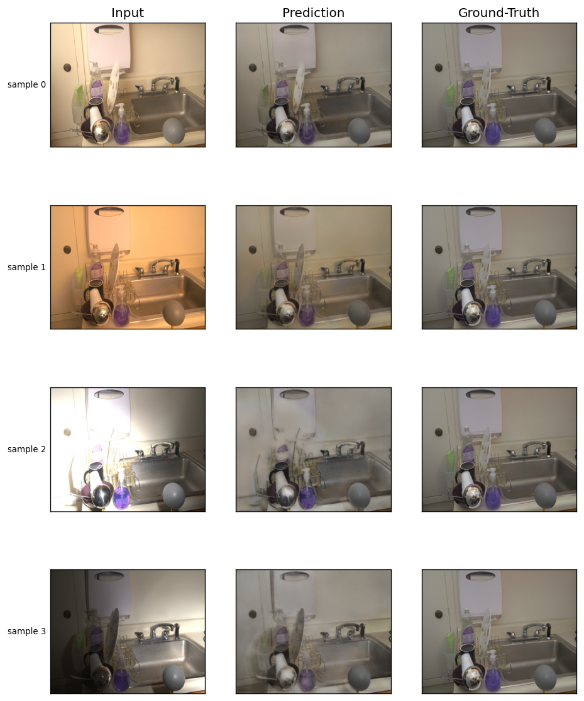
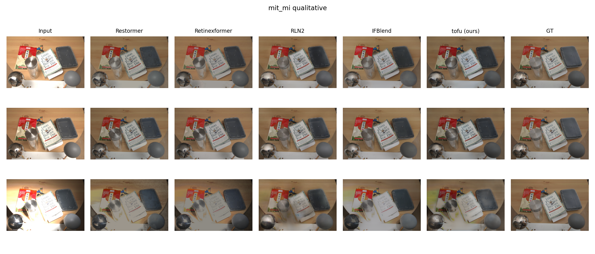
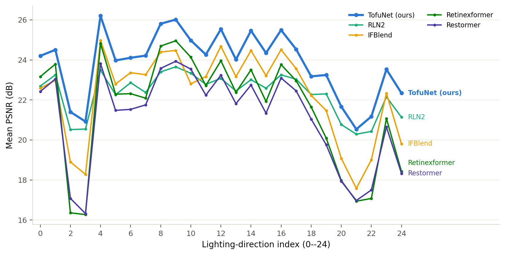
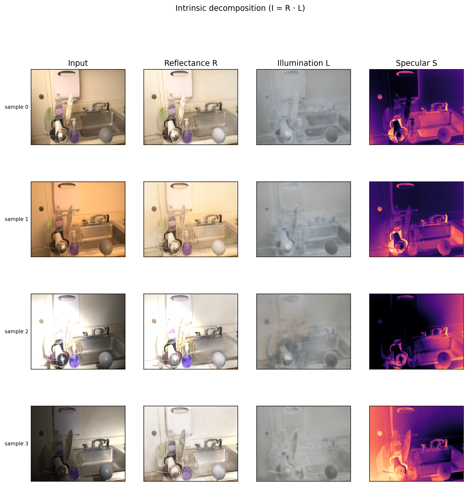
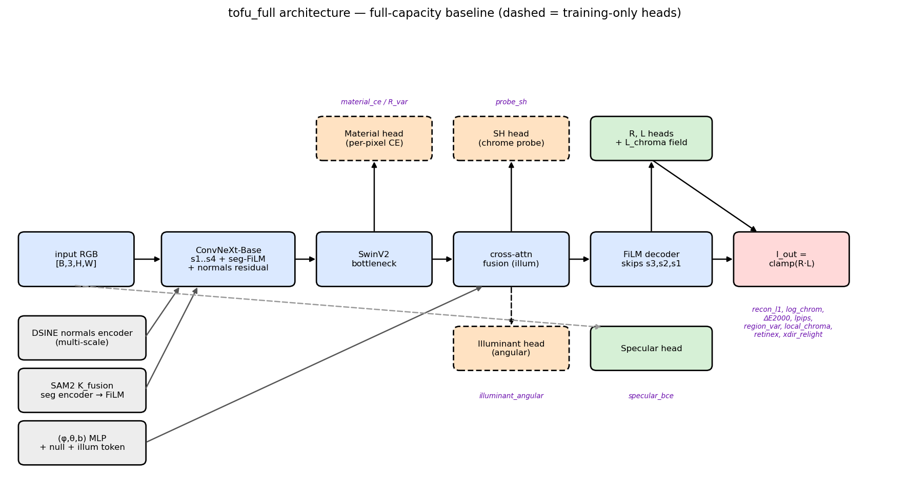
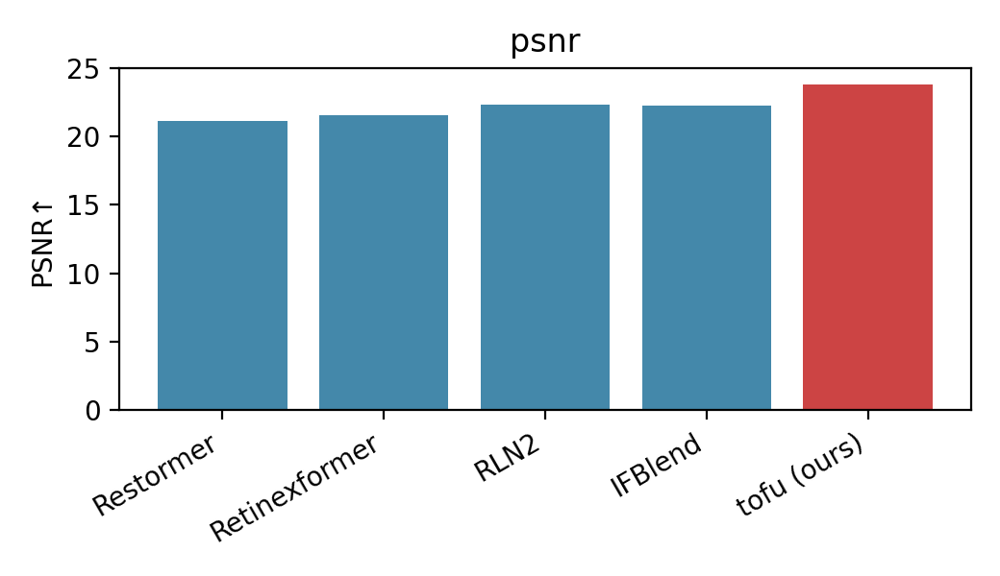
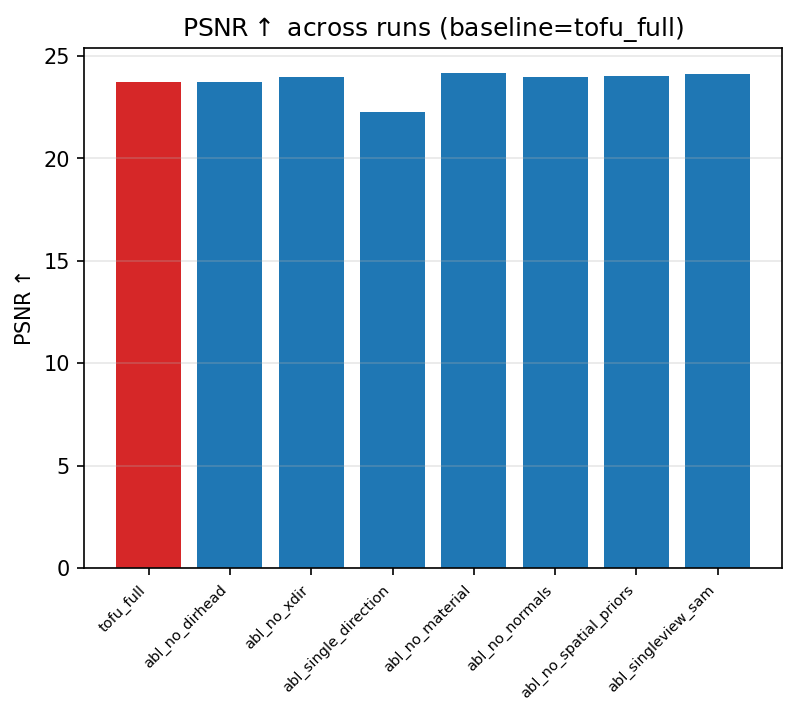

<h1 align="center">DAINet — Direction-Aware Illumination Network</h1>

<p align="center">
  <b>Direction-aware, physics-guided single-image illumination normalization for indoor scenes.</b><br>
  Given one photograph shot under directional lighting, DAINet recovers the scene's
  flat-lit, globally white-balanced appearance — removing shading gradients, cast shadows
  and directional colour, while emitting an interpretable reflectance / illumination factorization.
</p>

<p align="center">
  <br>
  <sub>The input cycles through 25 flash directions of the same scene; DAINet's corrected output stays stable.</sub>
</p>

---

<p align="center">
  <b>Anirban Das</b> &nbsp;·&nbsp; Erasmus Mundus MSc <b>COSI</b> (Colour in Science and Industry) &nbsp;·&nbsp; 2026<br>
  <sub>
  Academic supervisors: <b>Prof. Seyed Ali Amirshahi</b> · <b>Prof. Luis Gómez Robledo</b> &nbsp;|&nbsp;
  Host supervisors: <b>Prof. Theo Gevers</b> · <b>Dr. Sezer Karaoglu</b> (3DUniversum / University of Amsterdam)<br>
  📧 <a href="mailto:anirbandas.das98@gmail.com">anirbandas.das98@gmail.com</a> &nbsp;·&nbsp; 🐙 <a href="https://github.com/46code">@46code</a>
  </sub>
</p>

---

## Contents

- [Overview](#overview)
- [Results at a glance](#results-at-a-glance)
- [Architecture](#architecture)
- [Repository layout](#repository-layout)
- [Installation](#installation)
- [Data setup](#data-setup)  ← how to place the raw data and rebuild the estimated priors
- [Training](#training)
- [Inference](#inference)
- [Evaluation](#evaluation)
- [Benchmark](#benchmark)
- [Pretrained weights & full results](#pretrained-weights--full-results)
- [Citation](#citation) · [Acknowledgements](#acknowledgements) · [License](#license)

---

## Overview

Indoor appearance can be modelled as two latent factors: **reflectance** `R(x)` (material colour,
independent of the light) and **illumination** `L(x, ω)`, which depends on the flash direction
`ω = (φ, θ)` and scene geometry. Correcting a photo to its flat-lit appearance means undoing `L`.
DAINet learns this correction directly from a single sRGB image and reconstructs

```
I_out = clamp(R · L, 0, 1)
```

with two dedicated heads for `R` and `L`. The task is deliberately scoped:

- **It is** a structured illumination-normalization system that outputs a corrected image *and*
  an interpretable `(R, L)` factorization.
- **It is not** a chromatic-only white-balance model, a low-light enhancer, an inverse-rendering /
  SVBRDF pipeline, or a tone-mapper.

The work is an **empirical investigation along two axes**:

- **RQ1 — Directional lighting.** Do multi-direction supervision, a cross-direction reflectance-
  consistency objective, and a learned direction head help?
- **RQ2 — Spatial priors.** Do surface normals, multi-view segmentation, and material supervision
  help beyond a direction-conditioned `R·L` core?

**Headline finding:** directional *diversity* in the training data is the single largest
contributor — training on 25 directions per scene versus one is worth **+1.47 dB**; several
auxiliary priors did not earn their place and were removed from the final model.

<p align="center">
   DAINet -> flat-lit reference"><br>
  <sub>Input (directional light) → DAINet correction → flat-lit reference.</sub>
</p>

---

## Results at a glance

**MIT-Multi-Illumination test set** (30 unseen scenes × 25 directions = 750 images, probe-masked,
native resolution). All models trained from scratch on MIT-MI at an equal budget.

| Model | PSNR ↑ | MS-SSIM ↑ | LPIPS ↓ | Params |
|---|:---:|:---:|:---:|:---:|
| Restormer (CVPR'22) | 21.10 | 0.846 | 0.165 | — |
| Retinexformer (ICCV'23) | 21.57 | 0.858 | 0.155 | — |
| IFBlend (ECCV'24) | 22.28 | 0.877 | 0.155 | 383 M |
| RLN2 (ICCV'25) | 22.32 | 0.877 | **0.145** | 370 M |
| **DAINet (ours)** | **23.83** | **0.880** | 0.218 | **126 M** |

**+1.51 dB PSNR over the strongest baseline (RLN2)**, best MS-SSIM, at a third of the parameters
and RGB-only inference. DAINet trades LPIPS at native resolution (disclosed and diagnosed:
the network operates at 512×640 and is upsampled — under network-resolution evaluation its
LPIPS is 0.126, competitive).

<p align="center">
  <br>
  <sub>Qualitative comparison on MIT-MI: input · baselines · <b>DAINet</b> · ground truth.</sub>
</p>

**Ablation study** (drop-one from the maximal configuration; MIT-MI test):

| Removed component | Axis | Effect |
|---|---|---|
| Multi-direction training (→ one direction/scene) | RQ1 | **−1.47 dB** (largest effect) |
| Cross-direction consistency (`xdir`) | RQ1 | +0.25 dB when removed — an identifiability/fidelity trade (kept: it enables cross-direction lighting transfer) |
| Material supervision | RQ2 | +0.44 dB when removed — an honest negative (coarse labels fight reconstruction) |

<p align="center">
  
  <br>
  <sub>Left: per-direction PSNR across the hemisphere. Right: interpretable reflectance / illumination factorization.</sub>
</p>

---

## Architecture

<p align="center">
  <br>
</p>

`DAINet` (`models/network.py`) is a two-head reflectance/illumination encoder–decoder:

- **Encoder** — ConvNeXt-Base backbone (ImageNet-pretrained, `features_only`), with per-stage
  **FiLM** conditioning from a SAM2 segmentation embedding (zero-init → identity at step 0).
- **Surface-normals fusion** — a multi-scale `NormalsEncoder` over 3-channel DSINE normals adds a
  zero-init residual onto each encoder stage (the backbone stays pure-RGB).
- **Bottleneck** — two SwinV2 self-attention blocks add global context at the coarsest scale.
- **Direction conditioning** — a continuous MLP encodes `(φ, θ, log-brightness)` via
  `[sin φ, cos φ, sin θ, cos θ, log b]`, driving bottleneck cross-attention + decoder FiLM.
  A learned **DirectionHead** predicts `(φ, θ, b)` so inference needs no capture metadata;
  15% classifier-free conditioning dropout trains a null token for RGB-only deployment.
- **Decoder** — five upsampling stages with skip connections and per-stage FiLM; two zero-init
  heads produce `R = sigmoid(logit(x) + r) ∈ (0,1)` and `L = exp(2.5·tanh(l)) ∈ [0.082, 12.2]`,
  reconstructing `I_out = clamp(R·L, 0, 1)`.
- **Training-only heads** — chrome-probe spherical-harmonic supervision, a material classifier,
  and optional specular/illuminant heads (all off at inference).
- **Identity-at-init** — composed zero-inits make both the conditioned and null forward passes the
  identity on the input at step 0. Final model ≈ **126 M** parameters; inference needs **only one
  RGB image** (SAM2 + DSINE priors are computed inline).

---

## Repository layout

```
models/        DAINet network + heads / encoders / decoder / fusion
losses/        loss modules + DAINetLoss orchestrator (manager.py)
data/          DAINetDataset, SAM fusion, segmentation, scene-pair sampling, probes
training/      trainer, evaluator, EMA, callbacks, wandb logging
evaluation/    metrics (PSNR / MS-SSIM / LPIPS), failure analysis, qualitative visualizer
experiments/   ablation registry (dainet_full + 7 one-knob runs)
configs/       dainet.yaml — the run-of-record config
scripts/       train / test / infer / run_experiment / finalize_checkpoint + data-prep (precompute_*)
ben_model/     from-scratch equal-budget benchmark harness (4 baselines x 4 datasets)
tests/         pytest invariant / regression suite
```

---

## Installation

```bash
# 1. Environment (Python 3.10, one 24 GB GPU)
conda create -n dainet python=3.10 -y
conda activate dainet

# 2. PyTorch (CUDA 12.1 build used in this work)
pip install torch==2.5.1 torchvision==0.20.1 --index-url https://download.pytorch.org/whl/cu121

# 3. Project dependencies + editable install
pip install -r requirements.txt
pip install -e .
```

**External prior models** (installed from source, not on PyPI):

```bash
# SAM2 — multi-view segmentation priors
git clone https://github.com/facebookresearch/sam2 ~/my_model/sam2 && pip install -e ~/my_model/sam2
#   weights -> ~/my_model/sam2_weights/sam2.1_hiera_large.pt

# DSINE — surface normals
git clone https://github.com/baegwangbin/DSINE ~/my_model/DSINE
#   checkpoint -> ~/my_model/DSINE/checkpoints/dsine.pt
pip install geffnet
```

All scripts run offline; they set `HF_HUB_OFFLINE=1` at entry to avoid network hangs.

---

## Data setup

> **The `data/raw/` tree is *not* shipped in this repository** (it is large and licensed
> separately). You must place the MIT-Multi-Illumination dataset yourself and rebuild the derived
> caches once with the commands below. `data/raw/` is git-ignored.

**Dataset:** [MIT-Adobe Multi-Illumination](https://projects.csail.mit.edu/illumination/)
(Murmann et al., 2019) — indoor scenes, each captured under **25 calibrated directional flashes**
with chrome + grey probe spheres and a **flat-lit reference** target.

### Expected on-disk layout

```
data/raw/
└── mit_mi/
    ├── jpg/{train,test}/<scene>/            # IN-SCOPE training inputs
    │   ├── dir_<0..24>_mip2.jpg             #   25 directional sRGB images
    │   ├── meta.json                        #   per-direction (phi, theta, brightness) + probe boxes
    │   ├── materials_mip2.png               #   MIT-MI material mask (training-only)
    │   └── probes/dir_<N>_{chrome,gray}256.jpg
    ├── jpg_gt/{train,test}/<scene>/target_clean.jpg   # flat-lit supervision target (one per scene)
    ├── test/input/test/<scene>/ , test/gt/test/<scene>/   # held-out test split
    │
    │   # ---- derived caches, rebuilt by the commands below ----
    ├── material_taxonomy.json               # committed artifact (material id remap)
    ├── sam_fusion_centroids.npy             # committed artifact (global K-means centroids)
    ├── sam_masks/{train,test}/<scene>/sam_mip2.npy       # SAM2 multi-view fusion ids
    ├── superpixels/{train,test}/<scene>/chroma_clusters_mip2.npy
    └── normals/{train,test}/<scene>/normal_mip2.npy      # DSINE surface normals
```

**Training reads JPG only** — no EXR/HDR is used at train time.

### The flat-lit ground truth (estimated from MIT-MI)

The supervision target `target_clean.jpg` is the sRGB rendering of `T = clamp(albedo * shading_flat, 0, 1)`,
where `albedo.exr` and `shading_flat.exr` are the dataset's inverse-rendering estimates. The pipeline
consumes only the pre-rendered JPG (the EXRs are provenance).

### Derived priors — how each is estimated and saved

Run these **once** after placing `jpg/` and `jpg_gt/` (repeat with `--splits test` for the test split;
test caches are always projected through the **frozen train centroids**, never re-clustered):

```bash
# material taxonomy (contiguous class remap)
python scripts/build_material_taxonomy.py --root data/raw/mit_mi/jpg --splits train \
       --out data/raw/mit_mi/material_taxonomy.json

# SAM2 multi-view fusion  (raw oversegmentation -> global K-means -> per-scene ids)
python scripts/precompute_sam.py --stage raw --root data/raw/mit_mi/jpg --splits train \
       --out data/raw/mit_mi/sam_masks --n_views 25 --min_area 64 \
       --weights ~/my_model/sam2_weights/sam2.1_hiera_large.pt --gpu 0
python scripts/build_sam_fusion_centroids.py --raw_root data/raw/mit_mi/sam_masks \
       --jpg_root data/raw/mit_mi/jpg --splits train \
       --taxonomy data/raw/mit_mi/material_taxonomy.json --k_fusion 64 \
       --out data/raw/mit_mi/sam_fusion_centroids.npy
python scripts/precompute_sam.py --stage final --out data/raw/mit_mi/sam_masks --splits train \
       --centroids data/raw/mit_mi/sam_fusion_centroids.npy

# chromaticity super-pixels (region-coherence losses)
python scripts/precompute_superpixels.py --gt_root data/raw/mit_mi/jpg_gt --splits train \
       --out data/raw/mit_mi/superpixels --k 8

# surface normals (DSINE)
python -m scripts.precompute_normals --jpg_root data/raw/mit_mi/jpg \
       --out data/raw/mit_mi/normals --splits train --engine dsine --gpu 0
```

| Prior | Estimated by | Saved as | Used for |
|---|---|---|---|
| Surface normals | **DSINE** | `normals/<split>/<scene>/normal_mip2.npy` | encoder normals residual; recomputed inline at inference |
| Segmentation | **SAM2** (2-stage multi-view fusion + global K-means, K=64) | `sam_masks/<split>/<scene>/sam_mip2.npy` + `sam_fusion_centroids.npy` | per-stage FiLM conditioning |
| Material taxonomy | MIT-MI masks remapped | `material_taxonomy.json` | material classifier + R-variance loss (training-only) |
| Chroma super-pixels | K-means on Lab `(a*, b*)` | `superpixels/<split>/<scene>/chroma_clusters_mip2.npy` | region-coherence losses |

The two **committed** artifacts (`material_taxonomy.json`, `sam_fusion_centroids.npy`) are shared
across train / val / inference so every machine sees identical id spaces.

**Benchmark eval datasets** live under `data/raw/ben_data/{ambient6k,cl3an,wsrd24}/`; loose in-the-wild
images for `scripts/infer.py` go under `data/raw/online/`.

---

## Training

```bash
# run of record (maximal configuration)
python scripts/run_experiment.py --exp dainet_full --gpu 0
python scripts/run_experiment.py --exp dainet_full --gpu 0 --resume auto   # resume from latest.pt

# any ablation
python scripts/run_experiment.py --exp abl_no_spatial_priors --gpu 0       # the final model
# raw entry point:
python scripts/train.py --config configs/dainet.yaml --gpu 0
```

**Recipe:** 7 epochs · batch 10 · AdamW `lr=2e-5` (wd 0.01) · 1-epoch linear warm-up → cosine ·
AMP **bf16** forward / fp32 losses · grad-clip 1.0 · **EMA 0.999** (best checkpoint = max(live, EMA)
val PSNR) · 15% classifier-free conditioning dropout · seed 42. Runs land in `runs/<name>/`
(checkpoints, `logs/`, per-epoch JSON, wandb).

## Inference

Single RGB image → corrected image (SAM2 ids + DSINE normals computed inline; direction predicted):

```bash
python scripts/infer.py \
  --ckpt runs/abl_no_spatial_priors/checkpoints/model_final.pt \
  --input_dir data/raw/online --output_dir out/online --size 512,640 \
  --sam_weights ~/my_model/sam2_weights/sam2.1_hiera_large.pt --gpu 0

# before/after pair, optional gray-world illuminant refinement
python scripts/make_pair.py --ckpt <ckpt> --input photo.jpg --output corrected.png \
  --estimate_illuminant --illuminant_strength 0.6
```

<p align="center">
  <br>
  <sub>Input → DAINet correction (crossfade).</sub>
</p>

## Evaluation

Scores the model at full capacity from a single RGB (deployment contract), probe-masked, on
train/val/test → `runs/<name>/logs/metrics_by_split.json`:

```bash
python scripts/test.py --config runs/abl_no_spatial_priors/config.yaml \
  --ckpt runs/abl_no_spatial_priors/checkpoints/model_final.pt --gpu 0
```

Metrics: **PSNR** ↑, **MS-SSIM** ↑, **LPIPS** ↓ (single umbrella, all probe-masked).

---

## Benchmark

`ben_model/` retrains four external baselines **from scratch on MIT-MI** at an equal ~300 k-iteration
budget (each keeps its own recipe), then evaluates all five models on four datasets with identical,
probe-masked metrics.

| Baseline | Venue | Task |
|---|---|---|
| Restormer | CVPR'22 | general restoration transformer |
| Retinexformer | ICCV'23 | Retinex low-light / intrinsic decomposition |
| IFBlend | ECCV'24 | ambient lighting normalization |
| RLN2 (RLNet) | ICCV'25 | ambient lighting normalization (same task) |

**Eval datasets:** `mit_mi` (in-domain, probe-masked) · `ambient6k` · `cl3an` · `wsrd24`.
Cross-domain, every MIT-MI-trained model drops to a shared 13–14.5 dB band; within it DAINet takes
best PSNR on `ambient6k` and `wsrd24` and second on `cl3an` (the baselines' home benchmark).

```bash
# end-to-end (prep -> train -> infer -> score -> compare)
python ben_model/scripts/run_all.py --datasets mit_mi,ambient6k,cl3an,wsrd24
```

<p align="center">
  
  <br>
  <sub>Benchmark (left) and ablation (right) PSNR.</sub>
</p>

---

## Pretrained weights & full results

To keep the repository light, weights and full result artifacts are hosted separately.

| Bundle | Contents | Link |
|---|---|---|
| **DAINet_weights.zip** (~14 GB) | final checkpoint per model (8 DAINet runs + 4 baselines + backbone) | _add link_ |
| **DAINet_results.zip** | per-dataset predictions, leaderboards, tables, figures | _add link_ |

> Maintainer: paste the cloud URLs above once uploaded.

Load a DAINet checkpoint:

```python
from scripts._infer_common import load_model_from_checkpoint
model, cfg = load_model_from_checkpoint("model_final.pt", "cuda")
```

---

## Citation

```bibtex
@mastersthesis{das2026dainet,
  title  = {Direction-Aware Single-Image Illumination Normalization via Cross-Direction
            Reflectance Consistency and Material-Anchored Supervision},
  author = {Anirban Das},
  school = {Erasmus Mundus MSc COSI (Colour in Science and Industry)},
  year   = {2026}
}
```

## Acknowledgements

Supervised by **Prof. Seyed Ali Amirshahi** and **Prof. Luis Gómez Robledo** (academic), and hosted
by **Prof. Theo Gevers** and **Dr. Sezer Karaoglu** at **3DUniversum / University of Amsterdam**.
Built on the MIT-Multi-Illumination dataset and on SAM2 and DSINE for the spatial priors; the
benchmark reuses the authors' released architectures for Restormer, Retinexformer, IFBlend and RLN2.

## License

Released for academic research. See `LICENSE` (add your preferred licence, e.g. MIT) before publishing.
