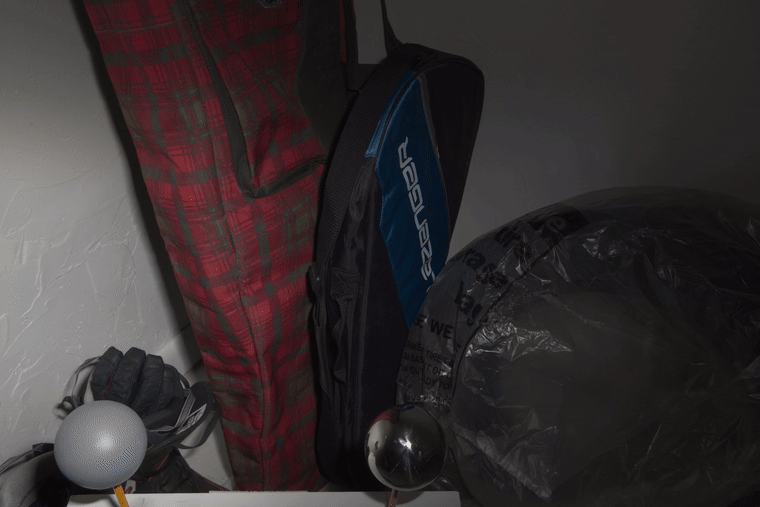

<h1 align="center">DAINet — Direction-Aware Illumination Network</h1>

<p align="center">
  <b>Direction-aware, physics-guided single-image illumination normalization for indoor scenes.</b>
</p>

<p align="center">
  <br>
  <sub>Input → DAINet correction (crossfade)</sub>
</p>

---

## Overview

DAINet factorizes a single directional sRGB photo into intrinsic reflectance $R$ and illumination $L$ to reconstruct a flat-lit reference image ($I_{\text{out}} = \text{clamp}(R \cdot L, 0, 1)$).

- **Core Finding:** Multi-direction training diversity provides a **+1.47 dB** gain over single-direction training.
- **Key Advantage:** Achieves state-of-the-art illumination normalization on MIT-MI at **126 M** parameters using single-image RGB-only inference.

---

## Benchmark Results (MIT-MI Test)

| Model | PSNR ↑ | MS-SSIM ↑ | LPIPS ↓ | Params |
| :--- | :---: | :---: | :---: | :---: |
| Restormer (CVPR'22) | 21.10 | 0.846 | 0.165 | — |
| Retinexformer (ICCV'23) | 21.57 | 0.858 | 0.155 | — |
| IFBlend (ECCV'24) | 22.28 | 0.877 | 0.155 | 383 M |
| RLN2 (ICCV'25) | 22.32 | 0.877 | **0.145** | 370 M |
| **DAINet (Ours)** | **23.83** | **0.880** | 0.218 | **126 M** |

---

## Quick Start

### Installation

```bash
conda create -n dainet python=3.10 -y && conda activate dainet
pip install torch==2.5.1 torchvision==0.20.1 --index-url [https://download.pytorch.org/whl/cu121](https://download.pytorch.org/whl/cu121)
pip install -r requirements.txt && pip install -e .
